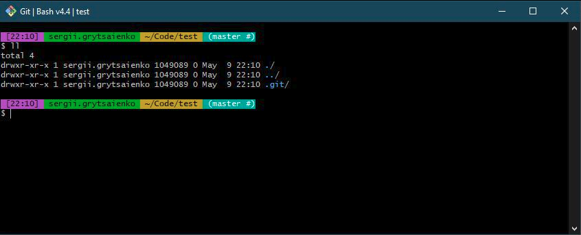

# Customize Git Bash Shell
## _Customize your Git Bash Shell with just one script!_


<br/>
<br/>


## Note: _You need Git Bash intalled to apply the stylings_ 
-  Refer to this link on how to install Git Bash: <br/>
🔗https://www.linode.com/docs/guides/how-to-install-git-on-linux-mac-and-windows/

- If your're using Windows - I'd encourage you to install Git Bash with Chocolatey:<br/>
🔗https://community.chocolatey.org/
- How to install Chocolatey:<br/> 
🔗https://chocolatey.org/install
- Once you installed Chocolatey, just run to install Git Bash:
    ```
    choco install git
    ```
- Verify if Git Bash was installed by running:
    ```
    git --version
    ```

 <br/>

## How to use this script to apply stylings:
>⚠️ `always check the source code before running it on your machine!`
- Download the script and run and 
    ```
    source setup.sh
    ```
### OR
- run it in your terminal:
    ```
    bash -c "$(curl -fsSL https://raw.githubusercontent.com/Sgryts/customize-git-bash/main/setup.sh)"
    ```
 ✨And your Git Bash Shell will look like this✨



## License

[](https://github.com/Sgryts/ng2-feature-toggle/blob/main/LICENSE)